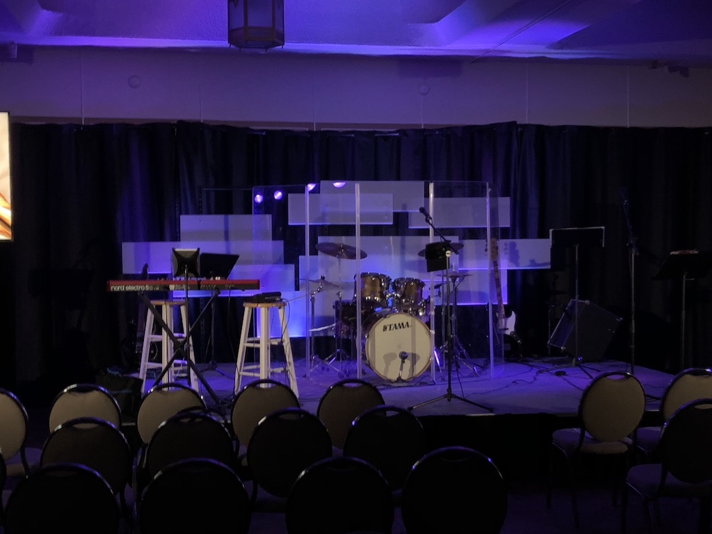
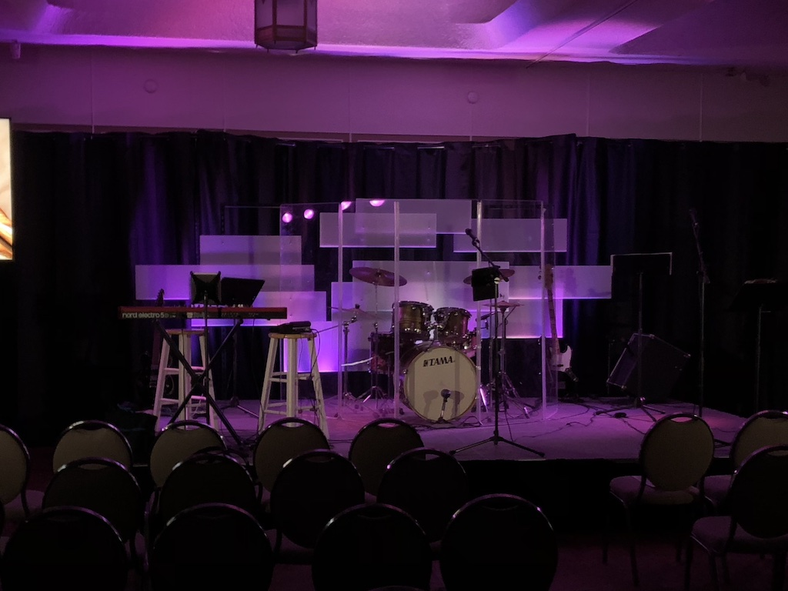

# Lights

The light board is programmable, defaults will be programmed to keep it simple while running lights each week. There should be no need to reprogram the lights on a weekly basis.

## Full Setup

For a full stage lighting, we have 2 spots in the back of the house, two color side-fill racks, and the fully lit backdrop (9 daisy-chained color spots). All lights will be programmed via the Obey 40 lightboard.

**Note:** Please ensure band doesn't run cables on top of the lights on the back pieces.

### Setup

- The setup team will assemble and roll in the 3 pieces that make the backdrop
  - Plug in the powerstrips between backdrop pieces ([Image](uploads/images/lights/IMG_0606.JPG))
  - Plug in DMX cables between the lights on the backdrop pieces ([Image](uploads/images/lights/IMG_0605.JPG)  ([Image](uploads/images/lights/IMG_0607.JPG))
  - Plug in the light controller  ([Image](uploads/images/lights/IMG_0609.JPG))
  - Make sure all light cans align with the rotation marks ([Image](uploads/images/lights/IMG_0637.JPG)) ([Image](uploads/images/lights/IMG_0639.JPG))
  - Plug in power from stage-right panel to the snake box
- Set up side fill lights
  - Plug in Power
  - Connect DMX control box to lights - in the same plug as the old transmitter ([Image](uploads/images/lights/IMG_0609.JPG))
  - Angle center 2 light cans onto stage floor ([Image](uploads/images/lights/IMG_0620.JPG))
  - Angle outer 2 light cans to ceiling ([Image](uploads/images/lights/IMG_0621.JPG))
- Setup back spotlights
  - Run T-Bar through safety cable ([Image](uploads/images/lights/IMG_0593.JPG))
  - Mount light on upper, center most post on the outer edge side of the T-Bar ([Image](uploads/images/lights/IMG_0594.JPG)) ([Image](uploads/images/lights/IMG_0595.JPG)))
  - Plug in power ([Image](uploads/images/lights/IMG_0616.JPG)) ([Image](uploads/images/lights/IMG_0617.JPG))
  - Plug in the DFI reciever ([Image](uploads/images/lights/IMG_0597.JPG)) ([Image](uploads/images/lights/IMG_0601.JPG))
  - Make sure the light is at about 8-9ft raised from the floor ([Image](uploads/images/lights/IMG_0601.JPG))
  - Point the light at center of stage
  - Close the doors on the light to keep it from hitting the TVs, above the back curtain, and below the knees of a person standing on the front of the stage ([Image](uploads/images/lights/IMG_0619.JPG))

### Running

- Power on the light board
- Make sure the blackout light is off (push the bottom right button to enable/disable)
- Pre-service lighting is program button 1, it will be dark
- During any speaker (announcements or message) use program button 2, it will have the highest spot lights
- During worship, use program buttons 3-8 see [next section](lights.md#Full_Stage_Lighting_Examples)
  - Program button 3 is Pink/Purple
  - Program button 4 is Blue
  - Program button 5 is Green/Teal
  - Program button 6 is Red/Orange
  - Program button 7 is Mix Orange/Blue/Purple
  - Program button 8 is Mix Orange/Yellow/Pink
- If there is any need to override the spot or side fills, see [Manual Overrides](lights.md#Manual_Overrides)

#### Full Stage Lighting Examples

## Mobile/Small Setup

Mobile or Small setups will not include the backdrop and lights, and may not include the spotlights.

### Setup

- Set up side fill lights
  - Plug in Power
  - Connect DMX control box to lights - in the same plug as the old transmitter ([Image](uploads/images/lights/IMG_0609.JPG))
  - Angle center 2 light cans onto stage floor ([Image](uploads/images/lights/IMG_0620.JPG))
  - Angle outer 2 light cans to ceiling ([Image](uploads/images/lights/IMG_0621.JPG))
- Setup back spotlights (If used)
  - Run T-Bar through safety cable ([Image](uploads/images/lights/IMG_0593.JPG))
  - Mount light on upper, center most post on the outer edge side of the T-Bar ([Image](uploads/images/lights/IMG_0594.JPG)) ([Image](uploads/images/lights/IMG_0595.JPG)))
  - Plug in power ([Image](uploads/images/lights/IMG_0616.JPG)) ([Image](uploads/images/lights/IMG_0617.JPG))
  - Plug in the DFI reciever ([Image](uploads/images/lights/IMG_0597.JPG)) ([Image](uploads/images/lights/IMG_0601.JPG))
  - Make sure the light is at about 8-9ft raised from the floor ([Image](uploads/images/lights/IMG_0601.JPG))
  - Point the light at center of stage
  - Close the doors on the light to keep it from hitting the TVs, above the back curtain, and below the knees of a person standing on the front of the stage ([Image](uploads/images/lights/IMG_0619.JPG))

**Note:** See the manual overrides section for running lights with side-fills only.

### Running

Our current setup shouldn't need any manual color setting, it should all be run off of pre-programmed scenes.

With a full setup, pre-service should use scene 1 - a low side fill and back lights with no spots.

During worship, use scenes 3-8 to match or pair with the side screens.

During announcements and the message, use scene 2 to give more front lighting.

## Manual Overrides

To manually override the side fills:

- Select ONLY fixture 2 ([Image](uploads/images/lights/IMG_0625.JPG))
- Use the first 3 sliders to adjust RGB values of the lights as done on the old board ([Image](uploads/images/lights/IMG_0624.JPG))

To manually override the spots:

- Select ONLY fixture 1 ([Image](uploads/images/lights/IMG_0626.JPG))
- Use only slider 1 to adjust intensity

When a scene is selected, unselecting a fixture will return it to a scene default. What this means is you can only have one override active at a time, generally it will only need to be the side fills.

**WARNING** Do not override the back lights (fixtures 3-11). They are currently not set to take individual programming.