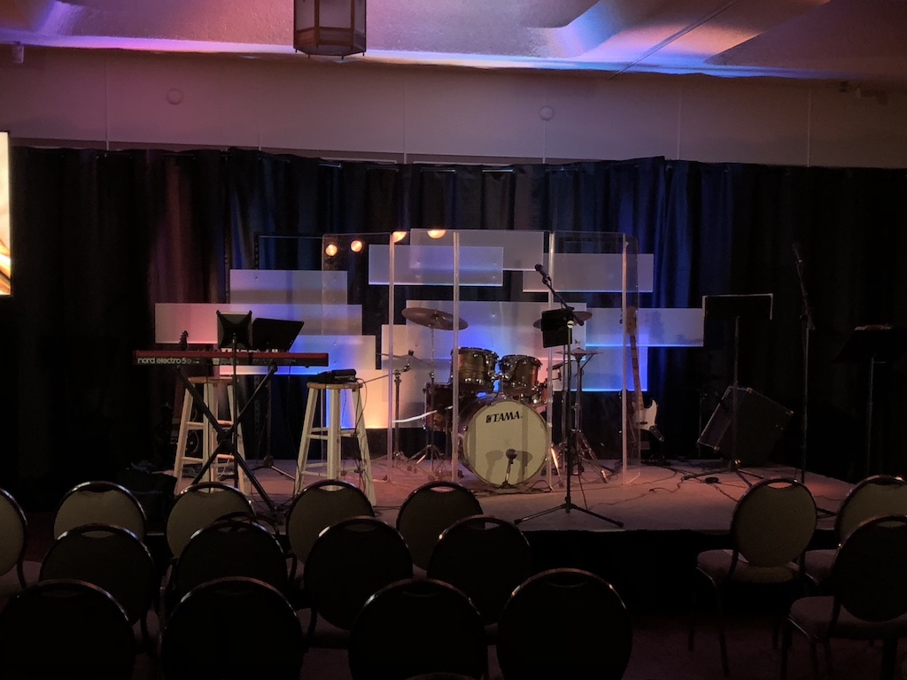
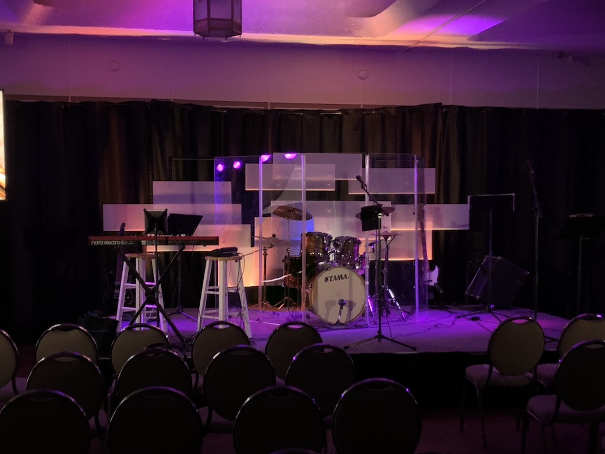

# Lights

The light board is programmable, defaults will be programmed to keep it simple while running lights each week. There should be no need to reprogram the lights on a weekly basis.

## Full Setup

For a full stage lighting, we have 2 spots in the back of the house, two color side-fill racks, and the fully lit backdrop (9 daisy-chained color spots). All lights will be programmed via the Obey 40 lightboard.

**Note:** Please ensure band doesn't run cables on top of the lights on the back pieces.

### Setup

- The setup team will assemble and roll in the 3 pieces that make the backdrop
  - Plug in the powerstrips between backdrop pieces
  - Plug in DMX cables between the lights on the backdrop pieces
  - Plug in the light controller
  - Make sure all light cans align with the rotation marks
  - Plug in power from stage-right panel to the snake box
- Set up side fill lights
  - Plug in Power
  - Connect DMX control box to lights
  - Angle center 2 light cans onto stage floor
  - Angle outer 2 light cans to ceiling
- Setup back spotlights
  - Run T-Bar through safety cable
  - Mount light on upper, center most post on the outer edge side of the T-Bar
  - Plug in power
  - Plug in the DFI reciever
  - Make sure the light is at about 8-9ft from the floor
  - Point the light at center of stage
  - Close the doors on the light to keep it from hitting the TVs, above the back curtain, and below the knees of a person standing on the front of the stage

### Running

- Power on the light board
- Make sure the blackout light is off (push the bottom right button to enable/disable)
- Pre-service lighting is program button 1, it will be dark
- During any speaker (announcements or message) use program button 2, it will have the highest spot lights
- During worship, use program buttons 3-8
  - Program button 3 is Pink/Purple
  - Program button 4 is Blue
  - Program button 5 is Green/Teal
  - Program button 6 is Red/Orange
  - Program button 7 is Mix Orange/Blue/Purple
  - Program button 8 is Mix Orange/Yellow/Pink
- If there is any need to override the spot or side fills, see [Manual Overrides](lights.md#Manual_Overrides)

#### Full Stage Lighting Examples

## Mobile/Small Setup

Mobile or Small setups will not include the backdrop and lights, and may not include the spotlights.

### Setup

- Set up side fill lights
  - Plug in Power
  - Connect DMX control box to lights
  - Angle center 2 light cans onto stage floor
  - Angle outer 2 light cans to ceiling
- Setup back spotlights (If Used)
  - Run T-Bar through safety cable
  - Mount light on upper, center most post on the outer edge side of the T-Bar
  - Plug in power
  - Plug in the DFI reciever
  - Make sure the light is at about 8-9ft from the floor
  - Point the light at center of stage
  - Close the doors on the light to keep it from hitting the TVs, above the back curtain, and below the knees of a person standing on the front of the stage 

### Running

## Manual Overrides